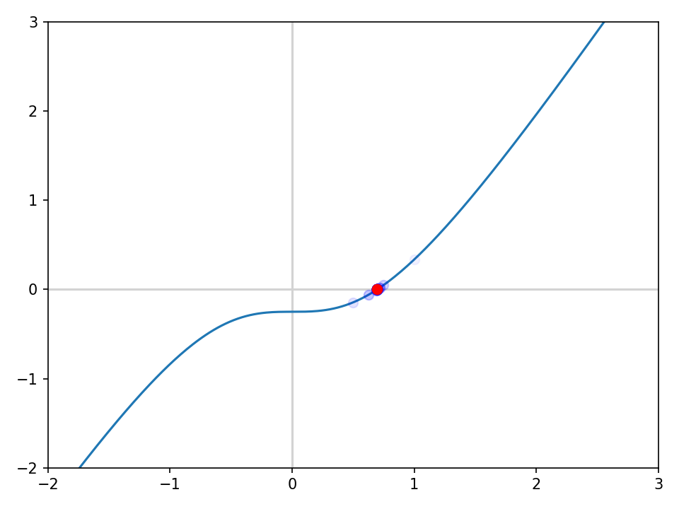
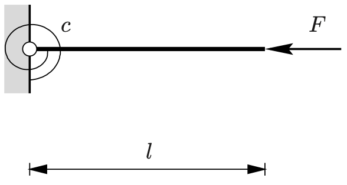
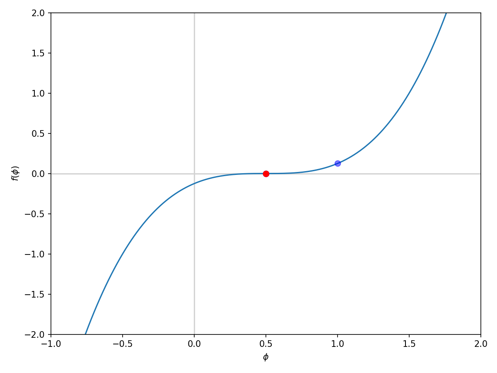
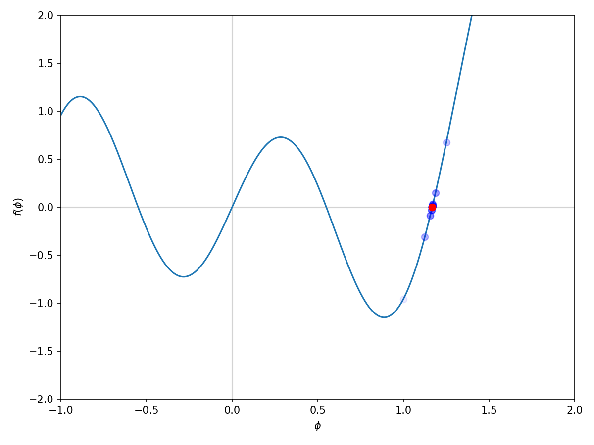
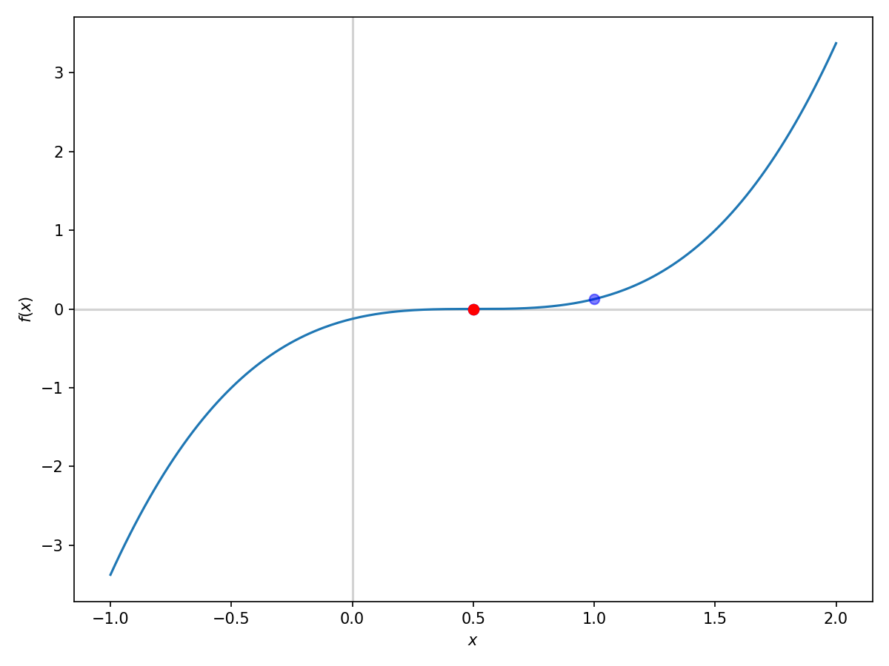

# Bisection Method

## Overview
Bisection root finding method is implemented in this script.

## Dependencies
- Python 3.8 or higher
- `numpy 2.2.* `
- `matplotlib 3.10.*`

## Setup and Usage
1. Clone or download the code.
2. Install dependencies:
    ```
    pip install -r requirements.txt
    ```
3. you can define your function using either a lambda function or regular python function.
* Example: To find roots of:
$$y = x^2 - 4$$ 
* Using lambda functions:
```python
f = lambda x: x**2 - 4
```
* Using python functions:
```python
def f(x):
    return x**2 - 4
```
4. Define the interval (`2D list`), maximum number of iterations (`int`), and the stopping tolerance (`float`) and Give the function as well as all theser parameters as the input to the `bisection()` function in  `bisection_method.py`:
```python
from bisection_method import bisect
interval = [0, 2]
max_iter = 100
TOL = 1e-6
root, func_val_at_root, root_history = bisect(f, interval, max_iter, TOL)
```
## Examples
1. One DOF problem:
    * find w for which (K = 1, l = 1, F = 0.25):
$$2K [\sqrt{l^2 + w^2} - l]\frac{w}{\sqrt{l^2 + w^2}} - F = 0$$

```python
interval = [0, 2]
Tol = 1e-6
max_iter = 100
f = lambda w: 2*K*(np.sqrt(l**2 + w**2) - l) * (w)/(np.sqrt(l**2 + w**2)) - F
root, f_at_root, root_hist = bisect(f, interval, max_iter, Tol)
```
<div align="center">

</div>
2. Biforcation Problem (Nonlinear finite element methods, Wriggers, 2008):

* Given the spiral spring constant `c = 1`, the length of the bar `l = 1` and the force `F = 1.5`, find the value of `phi` for which the system is in equilibrium.
<div align="center">

</div>

* In this problem we can see how bisection method can be used to find only one root of an unstable system given the correct initial guess.
```python
interval = [0, 90]
max_iter = 100
Tol = 1e-6
K = 1
l = 1
F = 1.5
f = lambda phi: (phi*np.pi/180)/np.sin(phi*np.pi/180) - F*l/K
root, f_at_root, root_hist = bisect(f, interval, max_iter, Tol)
```
<div align="center">

</div>

3. Solving other equations:
To solve other equations, you can define the function and the interval and use the `bisect()` function to find the root.
    1.  $$y = (x-0.5)^3$$
```python
interval = [0, 2]
max_iter = 100
Tol = 1e-6
f = lambda x: (x-0.5)**3
root, f_at_root, root_hist = bisect(f, interval, max_iter, Tol)
```
<div align="center">

</div>
    2. $$y = sin(5x) + x^3 - x$$
```python
interval = [-2, 2]
max_iter = 100
Tol = 1e-6
f = lambda x: np.sin(5*x) + x**3 - x
root, f_at_root, root_hist = bisect(f, interval, max_iter, Tol)
```
<div align="center">

</div>
    3.  Here I have changed the Rosenbrock function so that it can be used with the bisection method$\elipses$
    $$(a_ - x)^2 + b(1 - x^2)^2 - 15 = 0$$
```python
interval = [0, 2]
max_iter = 100
Tol = 1e-6
a = 1
b = 10
f = lambda x: (a - x)**2 + b*(1 - x**2)**2 - 15
root, f_at_root, root_hist = bisect(f, interval, max_iter, Tol)
```
<div align="center">

</div>

## References

1. Wriggers, P. (2008). Nonlinear finite element methods. Springer Science & Business Media.