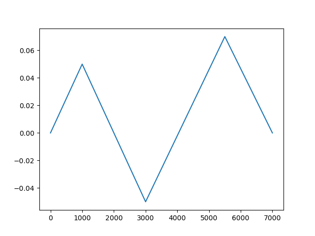
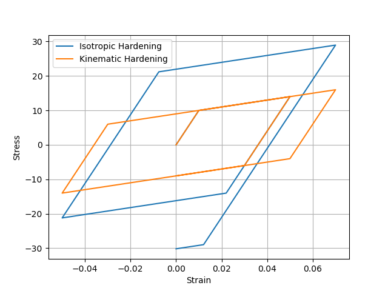

# Elasto Plastic Material Model
## Overview
The corrector predictor algorithm is used to model elasto plastic materials.

## Dependencies
- Python 3.8 or higher
- `numpy 2.2.* `
- `matplotlib 3.10.*`
- `pytest 6.2.*`
## Setup and Usage
1. Clone or download the code.
2. Install dependencies:
    ```
    pip install -r requirements.txt
    ```
3. You can use an Isotropic hardening `Isotropic_EP` or kinematic hardening `Kinematic_EP` material model. They both inherit from the `ElastoPlastic` class.

4. Give at least 2 of these material properties (Young's Modulus `E`, Tangent Modulus `E_t`, Hardening Modulus `H`)
and the yield stress `Y_0` to the `Material` class.
```python
mat = Isotropic_EP(E=1, E_t=1, H=1, Y_0=1)
```
5. Now define the loading profile using the `InputStrain` class. by defining the strain and loading steps to reach that strain.
for example to get a strain profile of 
<div align="center">

</div>

```python
eps = [0, 0.05, -0.05, 0.07, 0.0]
load_step_list = [1000, 2000, 2500, 1500 ]
input_strain = InputStrain(eps, load_step_list)
eps_array = input_strain.strain_profile()
```

6. Now you can use the `main_loop` function to get the stress-strain curve.
```python
sigma_list, eps_list = main_loop(mat, eps_array)
```
<div align="center">

</div>

## References

1. Wriggers, P. (2008). Nonlinear finite element methods. Springer Science & Business Media.