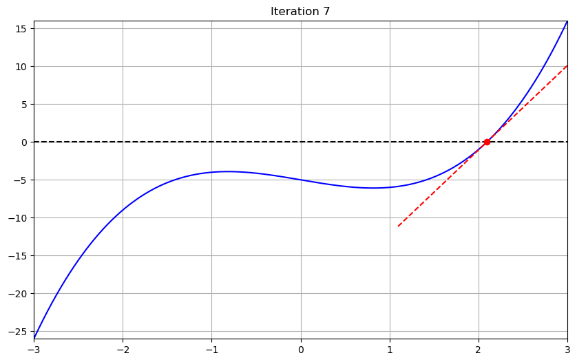
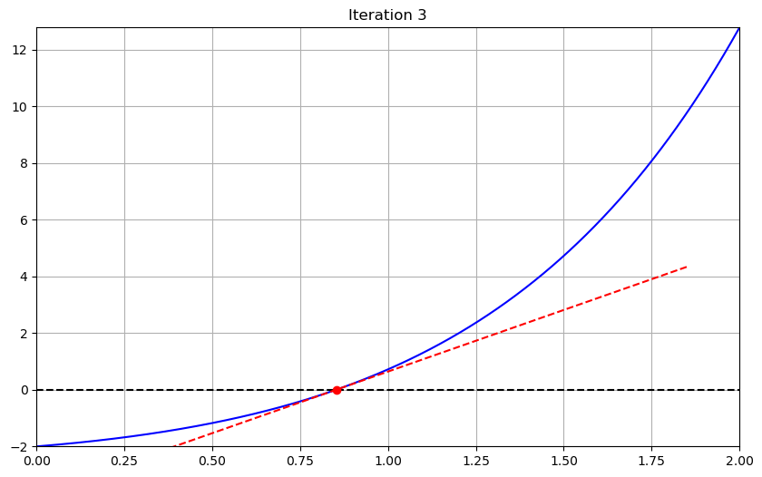

# Newton-Raphson Method
## Overview
Newton-Raphson root finding method is implemented in this script.

## Dependencies
- Python 3.8 or higher
- `numpy 2.2.* `
- `sympy 1.8.*`
- `matplotlib 3.10.*`

## Setup and Usage
1. Clone or download the code.
2. Install dependencies:
    ```
    pip install -r requirements.txt
    ```
3. you can define your function and Jacobian using a sympy function, a lambda function or regular python function.
* Example: To find roots of:
$$y = x^2 - 4$$ 
* Using sympy functions:
```python
from sympy import symbols
x = symbols('x')
f = x**2 - 4
J = f.diff(x)
# you have to lambdify them!
f = lambdify(x, f)
J = lambdify(x, J)
```
* Using lambda functions:
```python
f = lambda x: x**2 - 4
J = lambda x: 2*x
```
* Using python functions:
```python
def f(x):
    return x**2 - 4
def J(x):
    return 2*x
```
4. Define the initial guess (`np.array`), maximum number of iterations (`int`), and the stopping tolerance (`float`) and Give the function as well as all theser parameters as the input to the `newton_raphson()` function in  `newton_raphson.py`:
```python
from newton_raphson_script import newton_raphson
initial_guess = np.array([2])
max_iter = 100
tol = 1e-6
store_history = True # if you want to store the history of the iterations
result1 = newton_raphson(f1, J1, init_guess=-2.0, max_iter=100, tol=1e-6, store_history=True)
```
5. To run tests you can use `pytest` in the root directory by running:
    ```
    pytest
    ```
## Examples
1. Polynomial function:
    
$$x^3 - 2x -5 = 0$$

<div align="center">

</div>


```python
x = sp.symbols('x')
f1 = x**3 - 2*x - 3
J1 = sp.diff(f1, x)
f1 = sp.lambdify(x, f1)
J1 = sp.lambdify(x, J1)
result1 = newton_raphson(f1, J1, init_guess=-2.0)
```
---
2. A very non-linear function:

$$xe^x - 2 = 0$$

```python
x = sp.symbols('x')
f3 = x*sp.exp(x) - 2
J3 = sp.diff(f3, x)
f3 = sp.lambdify(x, f3)
J3 = sp.lambdify(x, J3)
result3 = newton_raphson(f3, J3, init_guess=1.0)
```
<div align="center">

</div>

## References

1. Wriggers, P. (2008). Nonlinear finite element methods. Springer Science & Business Media.